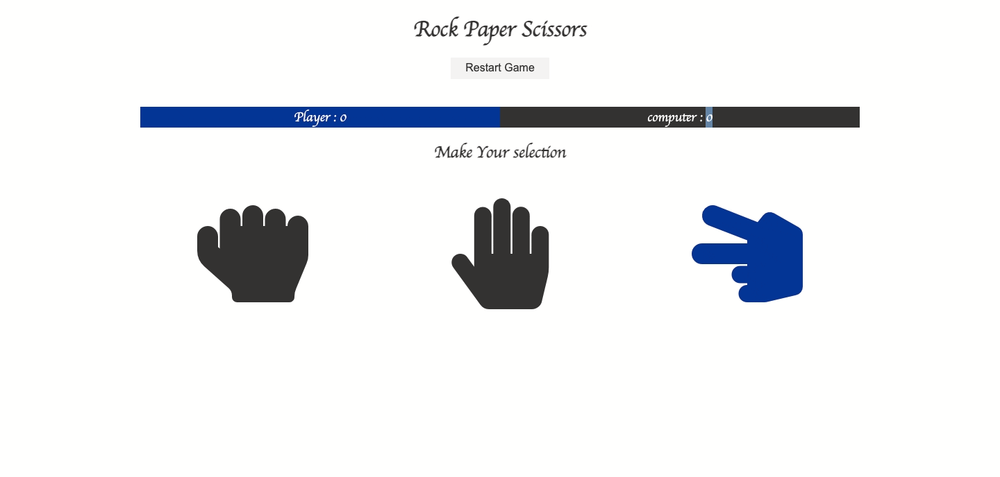
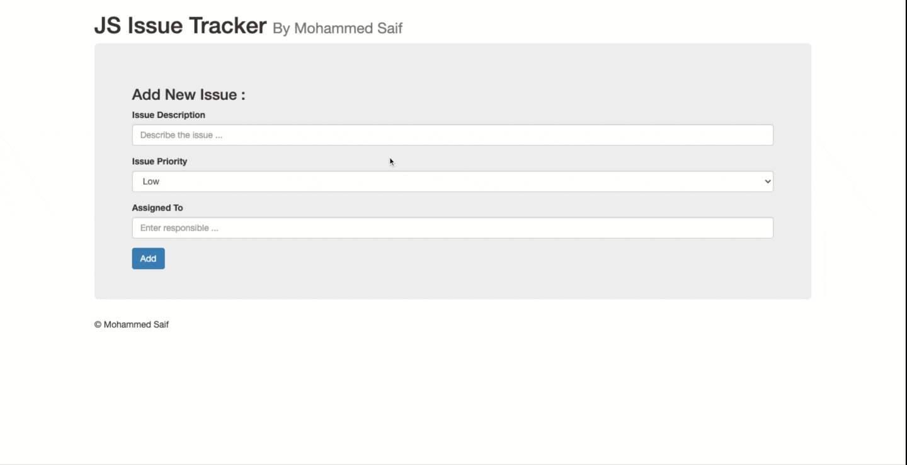
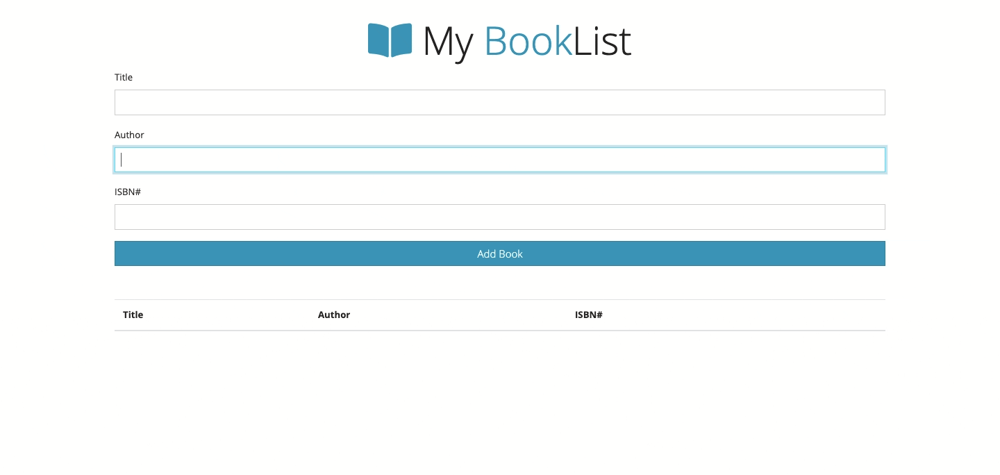
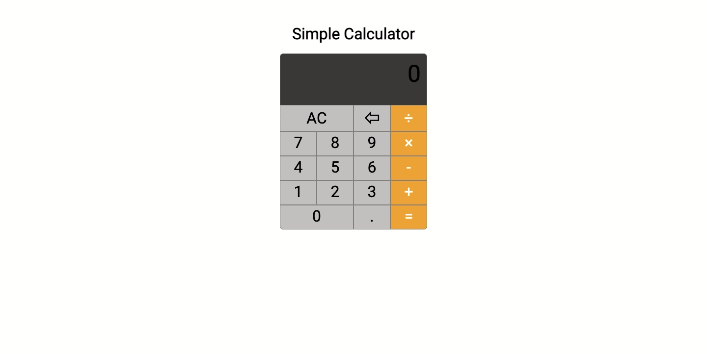
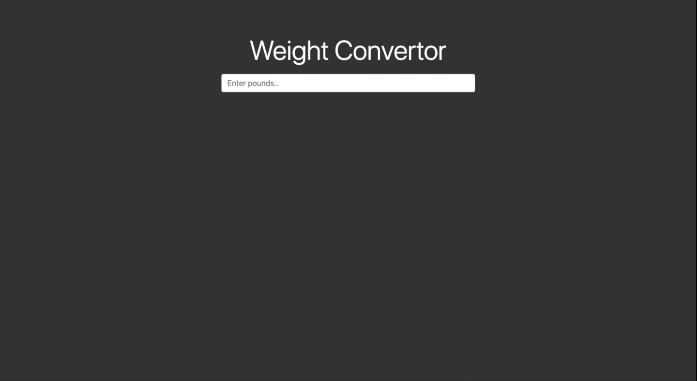
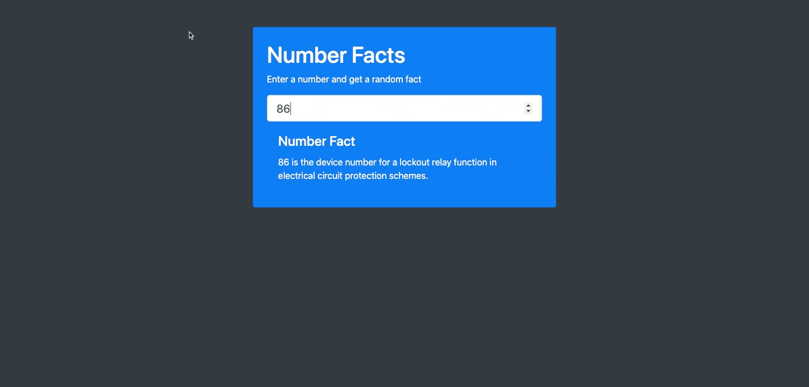

<h1 align="center"> Rock Paper Scissor Game  </h1>

### ✨ [Demo](https://mosaif00.github.io/Code-Along/RockPaperScissorGame/index.html)

##

<h1 align="center">JS Issues Tracker  </h1>

### ✨ [Demo](https://mosaif00.github.io/Code-Along/IssueTracker/index.html)

##

<h1 align="center">Book List  </h1>

### ✨ [Demo](https://mosaif00.github.io/Code-Along/booklistApp/index.html)

##

<h1 align="center">Simple Calculator  </h1>

### ✨ [Demo](https://mosaif00.github.io/Code-Along/simple-calculator/index.html)

##

<h1 align="center"> Weight Convertor  </h1>

### ✨ [Demo](https://mosaif00.github.io/Code-Along/weight-convertor/index.html)

##

<h1 align="center"> Fetch Number Facts  </h1>

### ✨ [Demo](https://mosaif00.github.io/Code-Along/NumberFactsApp/index.html)

##

## 🤝 Contributing

Contributions, issues and feature requests are welcome! Feel free to check [issues page](https://github.com/MoSaif00/code-Along-with-tutorials-/issues).
